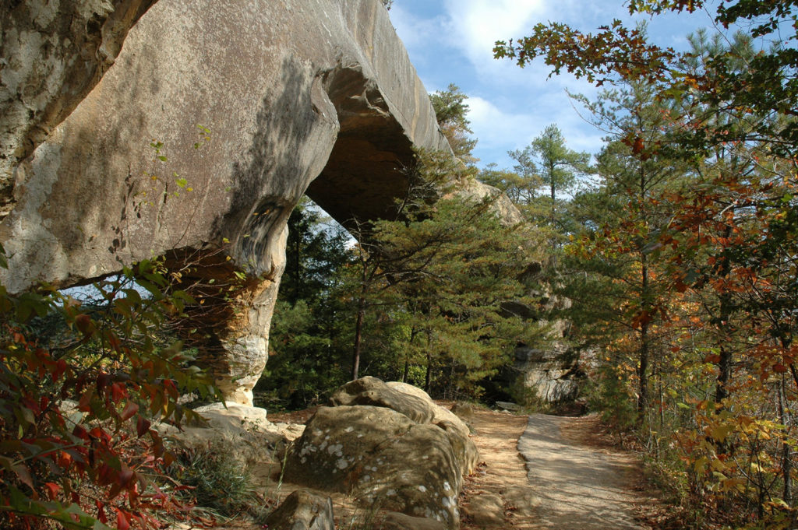

# rrg

Kentucky's Red River Gorge National Geological Area

## A Base map of arches

[Download a GeoPDF of arches](basemap/rrg-arches.pdf)

    
*Preview of map*

## View web page

[philipblaine.github.io/rrg](https://philipblaine.github.io/rrg)

## Cliffs and 3D views of Natural Bridge

* [Cliffs over 40 feet in height](elevation/)
* [Bird's Eye View](https://philipblaine.github.io/rrg/potree)

## Photographs of the Red River Gorge

     
Overlooking the Red River Gorge, from www.redrivergorge.com

     
Natural Bridge, from www.redrivergorge.com

    
Natural Bridge on another day, from www.redrivergorge.com
